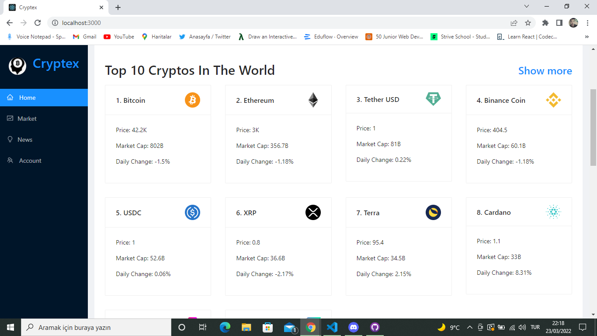
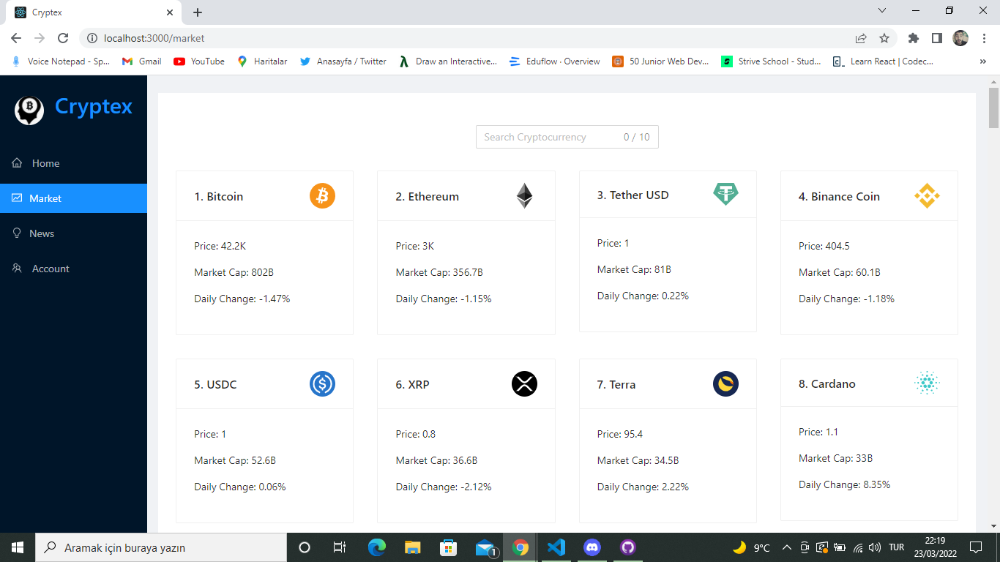
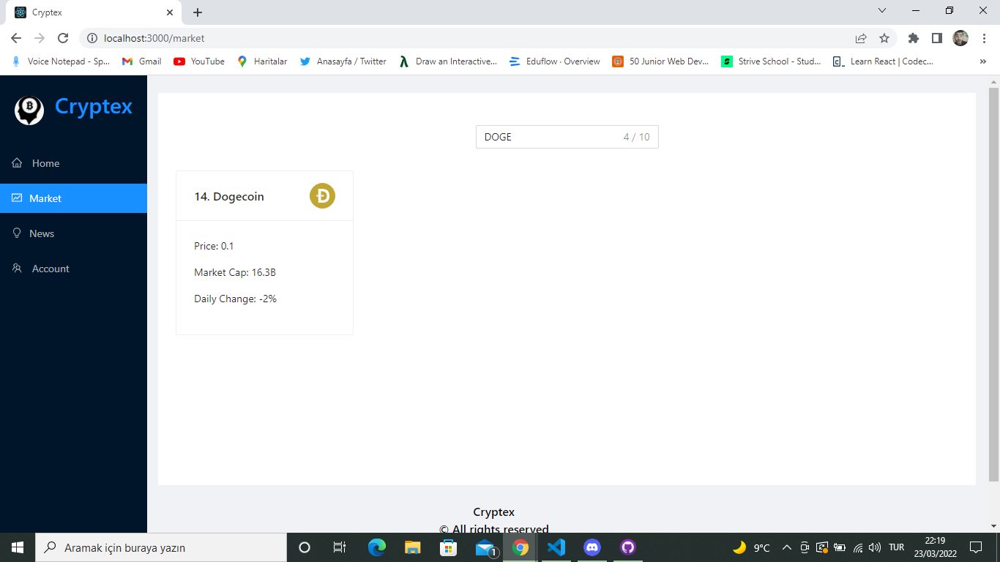
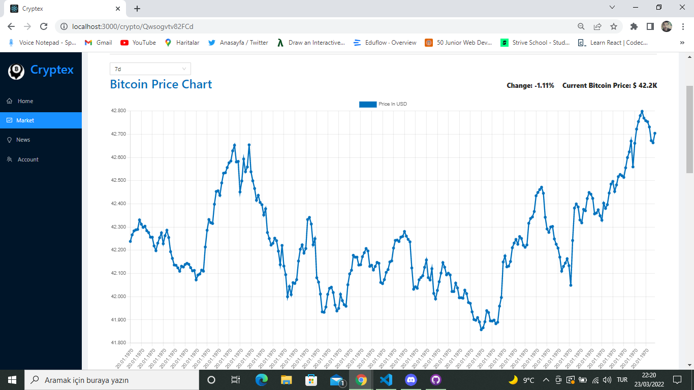
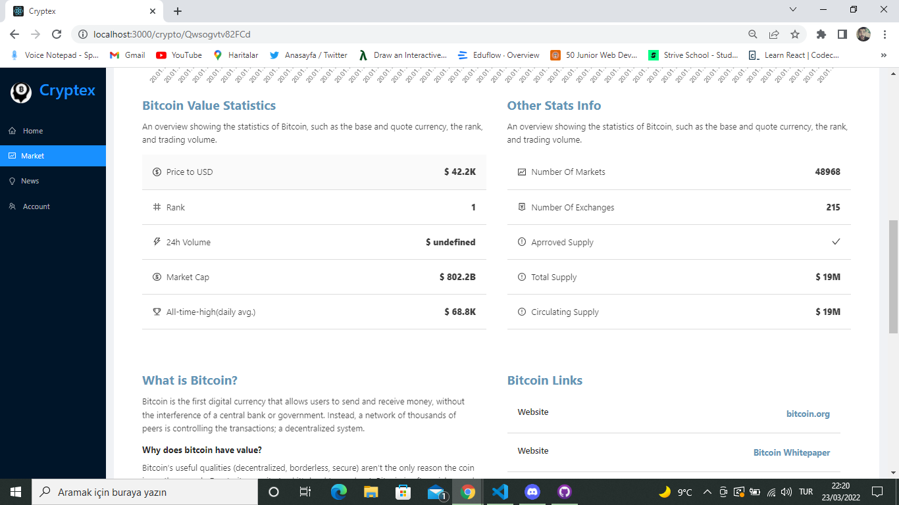
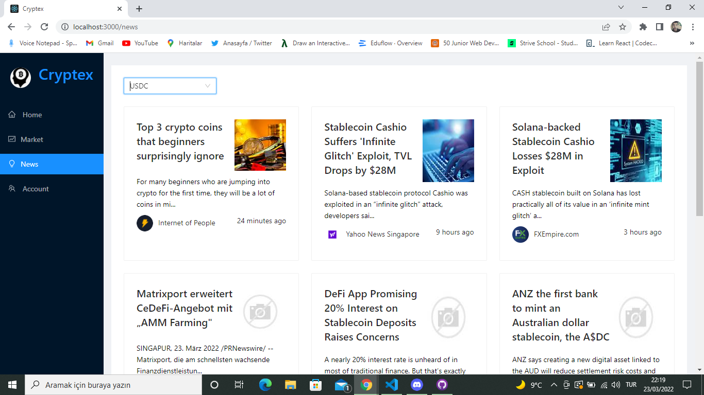
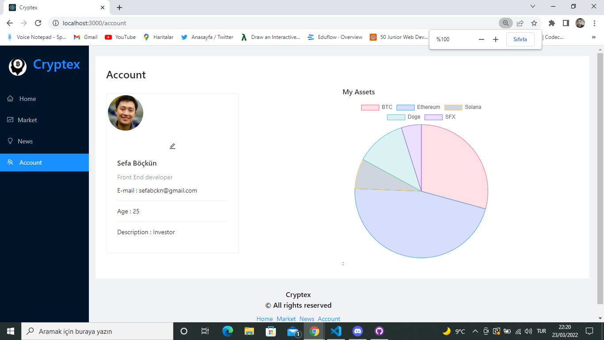
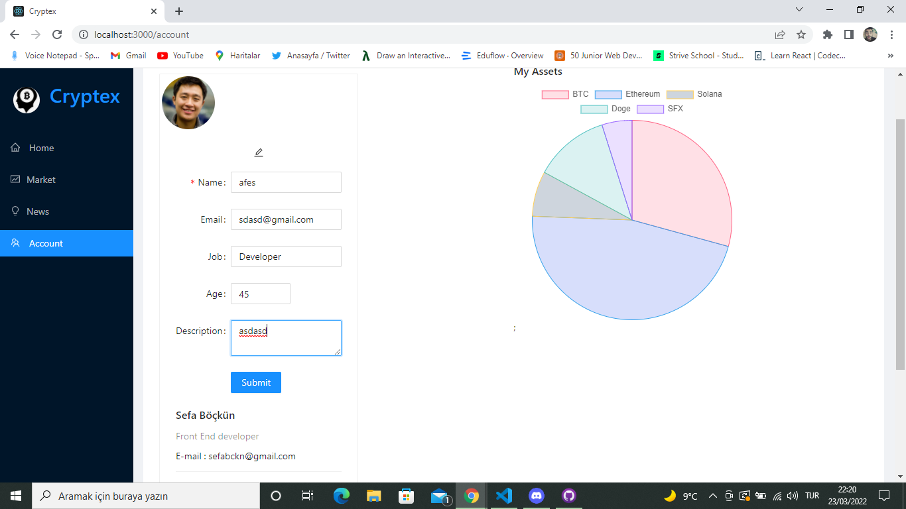

# CRYPTEX

Cryptex is a blockchain application that users can track up to 100 coins, more technical details about coins, also users are able to see the historical changes of any coin through the line chart, data displaying range can be arranged from 3h to 7days. Users are also able to display general crypto stats and updated news about the coins.

This project was created with by using the following Technologies:
  - Main UI library is <b>React JS</b>
  - State management and API calls been made with <b>REDUX TOOLKIT</b>.
  - User Experience created with <b>AntDesign</b> and components.
  - JSON Server for a fake <b>REST API</b>
  - <b>CSS</b>

## Navbar

Navbar is used to navigate user across the different sections which are <b>Home, Market, News, Account </b>

### Home Page

Home Page includes <b>Global Crytpo Stats</b>

Home Page Screenshot :

### Market Page

Market show 100 coins can be traded on trading platform. User is able to search any coins by using search bar.

Market Page Screenshot : 
Market Page Searching feature screenshot : 
Market Page Chart : 
Market Page Details : 

### News Page

Through this page the user is able to check news about coins.
News page screenshot : 
News page search feature screenshot : 
News page search category screenshot : 

### Account Page
Through this page the user is able to Update account details and display. User can see his assets in a pie Chart

Account page screenshot : 
Account page user details screenshot: 
